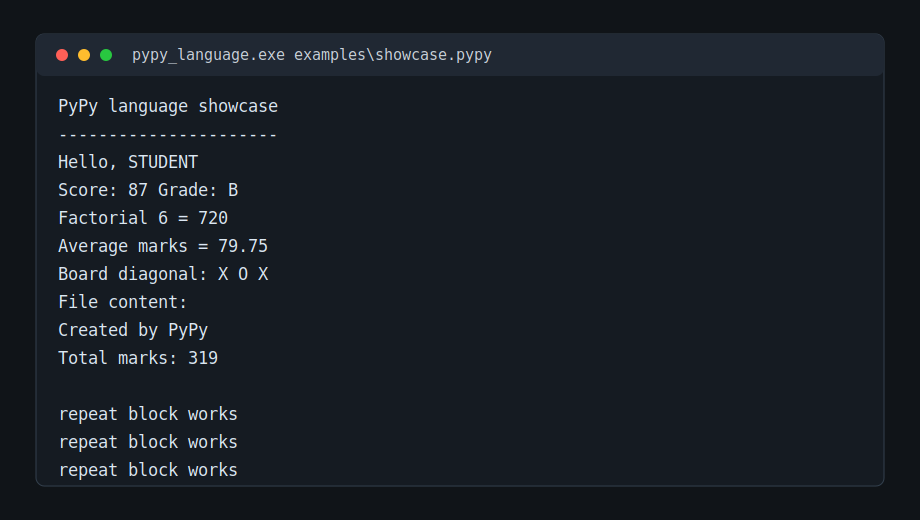
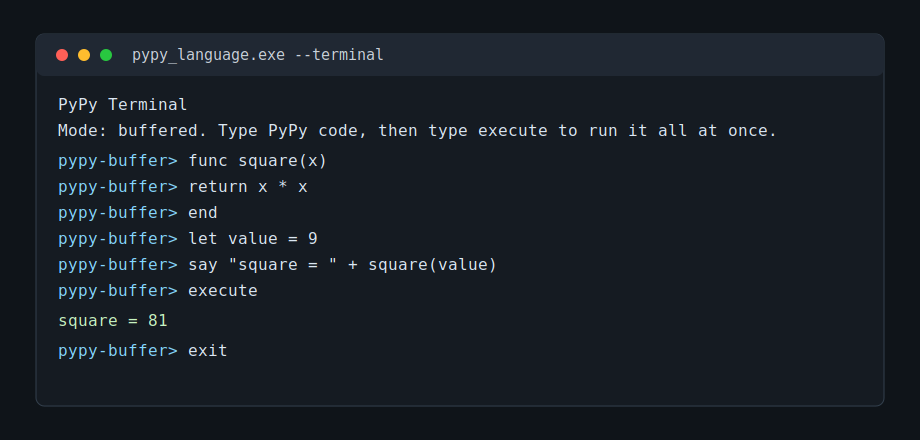

# PyPy C++ Language

PyPy C++ is a small custom programming language interpreter made in C++ for a university project presentation. It is designed to be simple, readable, and easy to demonstrate: code is written line by line, blocks end with `end`, and programs can be run either from `.pypy` script files or from a buffered terminal\ mode.

> Note: this project uses the name "PyPy" for a custom mini language. It is not the official PyPy Python runtime.

## Preview





## What This Project Shows

- A complete custom language interpreter written in C++
- Script execution from `.pypy` files
- Interactive buffered terminal mode
- Variables, expressions, conditions, loops, functions, arrays, and matrices
- Built-in text, math, random, algebra, input, and file functions
- Error reporting with line numbers and the original bad source line
- Example programs for demos, input handling, file storage, and error cases
- A mini hotel management system written in the custom language
- C++ implementation kept procedural: simple records plus standalone functions, without OOP-style type definitions

## Developer Documentation

For a complete function-by-function explanation of the C++ source code, see [DEVELOPER_FUNCTION_DOCUMENTATION.md](DEVELOPER_FUNCTION_DOCUMENTATION.md).

## Project Structure

```text
PyPyC++/
|-- pypy_language.cpp              # Core interpreter, parser, runtime, values, built-ins
|-- pypy_terminal.cpp              # Program entry point, CLI, script mode, terminal mode
|-- pypy_language.exe              # Compiled Windows executable
|-- LANGUAGE_GUIDE.md              # Short language syntax guide
|-- README.md                      # GitHub project documentation
|-- docs/
|   `-- screenshots/
|       |-- showcase-preview.svg
|       `-- terminal-preview.svg
`-- examples/
    |-- smoke.pypy
    |-- showcase.pypy
    |-- math_algebra.pypy
    |-- builtins_showcase.pypy
    |-- input_demo.pypy
    |-- hotel_management.pypy
    |-- errors.pypy
    |-- error_divide_by_zero.pypy
    |-- error_bounds.pypy
    |-- terminal_session.txt
    |-- terminal_input_session.txt
    |-- terminal_save_load_session.txt
    |-- input_answers.txt
    `-- hotel_demo_answers.txt
```

## Build And Run

The interpreter entry point is in `pypy_terminal.cpp`. That file includes `pypy_language.cpp`, so compile the terminal file:

```powershell
g++ pypy_terminal.cpp -o pypy_language.exe
```

Run a script:

```powershell
.\pypy_language.exe examples\showcase.pypy
```

Open buffered terminal mode:

```powershell
.\pypy_language.exe --terminal
```

Show help:

```powershell
.\pypy_language.exe --help
```

## Language Basics

PyPy is line based. Each instruction starts on its own line. Blocks are closed using `end`.

```pypy
let name = "student"
let score = 87

if score >= 50
    say "Pass"
else
    say "Fail"
end
```

### Variables And Output

```pypy
let x = 10
x = x + 5
say "x = " + x
```

`say` and `print` both display output.

### Input

```pypy
ask name "Name: "
let age = number(input("Age: "))
say "Hello, " + name
```

`ask` stores text directly into a variable. `input()` returns text inside an expression, which means it can be converted with functions like `number()`, `int()`, or `bool()`.

### Conditions

```pypy
if age >= 18
    say "Adult"
else
    say "Under 18"
end
```

Supported logic includes:

```pypy
and
or
not
==
!=
<
<=
>
>=
```

### Loops

```pypy
let i = 0
while i < 3
    say i
    let i = i + 1
end

repeat 3
    say "repeat block works"
end
```

### Functions

```pypy
func square(x)
    return x * x
end

say square(9)
```

Functions are scanned before execution, so they can be called from the script after being defined.

### Arrays And Matrices

```pypy
array marks[4]
set marks[0] = 73
set marks[1] = 88

matrix board[3][3]
set board[0][0] = "X"
set board[1][1] = "O"

say marks[0]
say board[1][1]
```

### File Handling

```pypy
filewrite "log.txt", "Program started\n"
fileappend "log.txt", "Program finished\n"

say fileread("log.txt")
say fileexists("log.txt")
say filesize("log.txt")
say linecount("log.txt")
```

This is used in the hotel management demo to save guest, booking, and payment records.

## Expression System

PyPy supports BODMAS/DMAS style expression order:

```pypy
say 2 + 3 * 4
say (2 + 3) * 4
say 2 + 3 * 4 ^ 2
```

Order of evaluation:

1. Brackets: `( ... )`
2. Exponents: `^`
3. Division, multiplication, modulo: `/`, `*`, `%`
4. Addition and subtraction: `+`, `-`
5. Comparisons and logic

PyPy uses explicit multiplication:

```pypy
let y = 3 * x ^ 2 + 2 * x - 5
```

Write `3 * x`, not `3x`.

## Built-In Functions

### Type Conversion

```pypy
str(123)
text(123)
number("45.5")
float("2.25")
int("45.9")
bool("")
type(99)
```

### Text

```pypy
len("hello")
upper("pypy")
lower("PyPy")
strip("  text  ")
substr("abcdef", 1, 3)
contains("abcdef", "cd")
find("abcdef", "cd")
startswith("hello", "he")
endswith("hello", "lo")
count("banana", "na")
replace("one two", "two", "three")
repeattext("*", 8)
charat("ABC", 1)
ord("A")
chr(66)
```

### Math

```pypy
abs(-12)
min(3, 9)
max(3, 9)
clamp(50, 0, 10)
floor(3.8)
ceil(3.1)
round(3.5)
sqrt(81)
pow(2, 8)
```

### Algebra Helpers

```pypy
linear_y(2, 5, 3)
solve_linear(2, -10)
quadratic_roots(1, -5, 6)
```

These are useful for showing mathematical expression handling during the presentation.

### Random

```pypy
seed(7)
randint(1, 10)
rand()
```

### File Helpers

```pypy
fileexists("log.txt")
fileread("log.txt")
filesize("log.txt")
linecount("log.txt")
```

## Demo Programs

### 1. Smoke Test

File: `examples/smoke.pypy`

```pypy
say "smoke"
let x = 2 + 3
say x
```

Expected preview:

```text
smoke
5
```

### 2. Main Showcase

File: `examples/showcase.pypy`

This demo shows functions, nested conditions, loops, arrays, matrices, file writing, file reading, and repeat blocks.

Run:

```powershell
.\pypy_language.exe examples\showcase.pypy
```

Preview:

```text
PyPy language showcase
----------------------
Hello, STUDENT
Score: 87 Grade: B
Factorial 6 = 720
Average marks = 79.75
Board diagonal: X O X
File content:
Created by PyPy
Total marks: 319

repeat block works
repeat block works
repeat block works
```

### 3. BODMAS And Algebra

File: `examples/math_algebra.pypy`

Run:

```powershell
.\pypy_language.exe examples\math_algebra.pypy
```

Preview:

```text
BODMAS and algebra demo
-----------------------
2 + 3 * 4 = 14
(2 + 3) * 4 = 20
2 + 3 * 4 ^ 2 = 50
(2 + 3 * 4) ^ 2 = 196
100 / 5 * 2 = 40
100 / (5 * 2) = 10
For y = 3x^2 + 2x - 5 and x = 4, y = 51
linear_y(2, 5, 3) means y = 2x + 3 at x = 5: 13
solve_linear(2, -10) solves 2x - 10 = 0: x = 5
quadratic_roots(1, -5, 6) solves x^2 - 5x + 6 = 0: x1 = 3, x2 = 2
```

### 4. Built-In Showcase

File: `examples/builtins_showcase.pypy`

This demo runs through text functions, conversions, math helpers, random functions, and file helpers.

Run:

```powershell
.\pypy_language.exe examples\builtins_showcase.pypy
```

### 5. Input Demo

File: `examples/input_demo.pypy`

```pypy
let name = input("Enter your name: ")
let age = number(input("Enter your age: "))

say "Hello, " + name
if age >= 18
    say "You are an adult."
else
    say "You are under 18."
end
```

Sample answers are stored in `examples/input_answers.txt`.

### 6. Hotel Management Demo

File: `examples/hotel_management.pypy`

This is the biggest presentation demo. It acts like a simple command-line hotel management system and uses PyPy file handling as a small text database.

It supports:

- Adding guests
- Reserving rooms
- Saving checkout and payment records
- Viewing database files
- Showing a basic hotel report
- Resetting saved hotel data

The program creates and updates:

```text
hotel_guests.db
hotel_bookings.db
hotel_payments.db
```

Run:

```powershell
.\pypy_language.exe examples\hotel_management.pypy
```

Sample demo input is stored in `examples/hotel_demo_answers.txt`.

## Terminal Mode

Terminal mode is buffered. This means normal PyPy lines are saved in memory first. The program only runs when you type `execute`.

```powershell
.\pypy_language.exe --terminal
```

Commands:

```text
execute     run all buffered code
show        print buffered code with line numbers
clear       clear buffered code
save path   save buffered code to a file
load path   load code from a file
help        show terminal commands
exit        close terminal
```

Example session:

```text
PyPy Terminal
Mode: buffered. Type PyPy code, then type execute to run it all at once.
pypy-buffer> func square(x)
pypy-buffer>     return x * x
pypy-buffer> end
pypy-buffer> let value = 9
pypy-buffer> say "square = " + square(value)
pypy-buffer> execute
square = 81
pypy-buffer> exit
```

## Error Handling

The interpreter reports errors with a message, line number, and the source line.

Example:

```pypy
say "This program should stop with a division-by-zero error."
say 100 / 0
```

Expected style:

```text
PyPy error at line 2: Division by zero.
  say 100 / 0
```

Other included error demos:

```powershell
.\pypy_language.exe examples\error_divide_by_zero.pypy
.\pypy_language.exe examples\error_bounds.pypy
```

## How The Interpreter Works

The interpreter is intentionally built with basic C++ features so it is easy to explain in a project presentation.

1. `pypy_terminal.cpp` handles command-line arguments.
2. In script mode, it loads a `.pypy` file into memory.
3. In terminal mode, it stores typed lines in a buffer until `execute`.
4. `pypy_language.cpp` stores source code in a `Program` structure.
5. Functions are pre-scanned and stored in a fixed-size function table.
6. The runtime uses an `Environment` to store variables, arrays, and matrices.
7. Expressions are tokenized and parsed with operator precedence.
8. Blocks like `if`, `while`, `repeat`, and `func` are matched using `end`.
9. Built-in functions are handled inside the expression system.
10. Runtime errors are stored in an `ErrorState` and printed by the terminal wrapper.

## Internal Limits

The project uses fixed-size limits to keep the implementation simple and presentation-friendly:

| Limit | Value |
|---|---:|
| Maximum program lines | 2000 |
| Maximum variables per scope | 150 |
| Maximum array or matrix cells | 400 |
| Maximum functions | 80 |
| Maximum function parameters | 12 |
| Maximum function arguments | 12 |
| Maximum tokens per expression | 500 |
| Maximum call depth | 35 |
| Maximum loop steps | 200000 |

These limits also help prevent infinite loops and oversized demo programs.

## Presentation Talking Points

- The project is not only syntax. It includes a lexer/tokenizer, expression parser, variable environment, control flow, functions, arrays, matrices, built-ins, file operations, and error handling.
- The language is beginner-friendly because every command is readable: `let`, `say`, `if`, `while`, `repeat`, `func`, `array`, `matrix`, and `set`.
- The hotel management example proves the language can be used for a small real program.
- Terminal mode shows that the interpreter can run code interactively, while script mode shows that it can execute saved programs.
- Error demos show that the interpreter catches invalid operations instead of silently failing.

## Suggested Demo Order

1. Show `examples/smoke.pypy` to prove the interpreter runs.
2. Show variables, `say`, and expressions.
3. Run `examples/math_algebra.pypy` to explain BODMAS and algebra helpers.
4. Run `examples/showcase.pypy` to demonstrate functions, arrays, matrices, files, and loops.
5. Open terminal mode and run a small buffered program.
6. Run `examples/hotel_management.pypy` as the final complete project demo.
7. Run one error example to show line-based error reporting.

## License

This project was created for learning and university presentation purposes.
